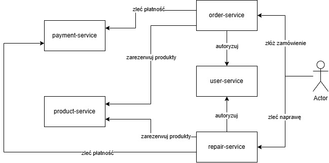

# VeloShop sklep rowerowy - projekt nr 4 Grupy C

## Członkowie zespołu

- Dawid Kryński
- Julia Zezula
- Kuba Wykocki
- Piotr Makoś

---

# 1. Zagadnienie biznesowe

VeloShop to internetowa platforma sprzedaży rowerów, części i akcesoriów rowerowych z dodatkową obsługą serwisu naprawczego.

System umożliwia przeglądanie katalogu, składanie zamówień, obsługę płatności, zgłaszanie napraw oraz śledzenie statusu zamówień i napraw.

## 1.1 Aktorzy systemu

- Klient niezalogowany - przegląda produkty, filtruje katalog i korzysta z koszyka.
- Klient zalogowany - składa zamówienia, płaci, sprawdza status zamówień i zgłasza naprawy.
- Administrator / pracownik - zarządza produktami, zamówieniami i naprawami.

## 1.2 Główne procesy biznesowe

- zakup rowerów, części i akcesoriów,
- zarządzanie katalogiem,
- obsługa zamówień,
- obsługa płatności,
- zgłaszanie i obsługa napraw,
- autentykacja użytkowników.

---

# 2. Wymagania funkcjonalne

## 2.1 Wymagania ogólne

- Użytkownik może przeglądać i filtrować produkty.
- Użytkownik może dodawać i usuwać produkty z koszyka.
- Użytkownik może utworzyć konto i zalogować się.
- Zalogowany użytkownik może złożyć i opłacić zamówienie.
- Zalogowany użytkownik może sprawdzić status zamówienia.
- Użytkownik może przeglądać dostępne terminy napraw.
- Zalogowany użytkownik może zgłosić naprawę roweru.
- Zalogowany użytkownik może sprawdzić status naprawy.
- System obsługuje mockowe płatności.
- System może symulować nieudaną płatność.
- Administrator może zarządzać produktami, zamówieniami i naprawami.

---

## 2.2 User Service

Odpowiada za rejestrację, logowanie i zarządzanie profilami użytkowników.

Serwis wydaje tokeny JWT podpisane wspólnym sekretem. Udostępnia też `authMiddleware.js`, używany przez pozostałe serwisy do weryfikacji tożsamości.

Role:

- `customer`
- `admin`

Endpointy:

```txt
POST /auth/register
POST /auth/login
GET /users/me
````

### POST `/auth/register`

```json
{
  "login": "janek",
  "firstName": "Jan",
  "lastName": "Kowalski",
  "email": "jan@example.com",
  "password": "haslo123"
}
```

### POST `/auth/login`

```json
{
  "login": "janek",
  "password": "haslo123"
}
```

`GET /users/me` wymaga JWT.

---

## 2.3 Product Service

Odpowiada za katalog produktów i stany magazynowe.

Zakres:

* lista produktów,
* szczegóły produktu,
* filtrowanie po nazwie, kategorii, cenie i dostępności,
* kategorie,
* ceny,
* stany magazynowe,
* rezerwacja produktów przez Order Service.

Endpointy:

```txt
GET /products
GET /products/categories
GET /products/:id
POST /products
PATCH /products/:id/stock
DELETE /products/:id
POST /products/:id/reserve
```

### GET `/products`

Query params:

```txt
search=&category=&minPrice=&maxPrice=&available=
```

### POST `/products`

Wymaga JWT i roli `admin`.

```json
{
  "name": "Trek Marlin 5",
  "category": "MTB",
  "price": 2499,
  "stock": 10,
  "description": "...",
  "imageUrl": "..."
}
```

### POST `/products/:id/reserve`

Endpoint wewnętrzny używany przez Order Service.

```json
{
  "quantity": 2
}
```

---

## 2.4 Order Service

Odpowiada za pełen cykl zamówienia: przyjęcie koszyka, weryfikację dostępności w Product Service, zainicjowanie płatności w Payment Service oraz finalizację.

Endpointy:

```txt
POST /orders
GET /orders
GET /orders/:id
PATCH /orders/:id/status
POST /orders/:id/retry-payment
```

### POST `/orders`

Wymaga JWT.

```json
{
  "items": [
    {
      "productId": 3,
      "quantity": 1
    },
    {
      "productId": 7,
      "quantity": 2
    }
  ],
  "deliveryAddress": "ul. Rowerowa 1, Warszawa",
  "paymentMethod": "card"
}
```

Przykładowe statusy:

```txt
pending
paid
failed
shipped
completed
cancelled
```

---

## 2.5 Payment Service

Mockowa bramka płatności. Symuluje przetwarzanie transakcji.

Serwis jest bezstanowy i nie zapisuje płatności w bazie danych.

Endpointy:

```txt
POST /payments/process
```

### POST `/payments/process`

```json
{
  "orderId": 15,
  "amount": 2499.00
}
```

Przykładowa odpowiedź:

```json
{
  "success": true,
  "transactionId": "TXN-ABC123XYZ",
  "message": "Płatność zrealizowana pomyślnie."
}
```

---

## 2.6 Repair Service

Odpowiada za obsługę zleceń serwisowych, kalendarz dostępności i wycenę terminu odbioru.

Klient zgłasza usterkę, opisując rower. W przepływie frontendu płatność za naprawę jest wykonywana w Payment Service przed utworzeniem zgłoszenia w Repair Service.

Endpointy:

```txt
GET /repair-services
GET /repair-calendar
POST /repair-estimate
POST /repairs
GET /repairs
GET /repairs/:id
PATCH /repairs/:id/status
DELETE /repairs
```

### POST `/repairs`

Wymaga JWT.

```json
{
  "bikeDescription": "Rower trekkingowy",
  "issueDescription": "Problem z hamulcami",
  "repairServiceId": 2,
  "dropOffDate": "2026-06-02"
}
```

### PATCH `/repairs/:id/status`

Wymaga JWT i roli `admin`.

```json
{
  "status": "in_progress"
}
```

Przykładowe statusy:

```txt
booked
accepted
in_progress
ready
completed
cancelled
```

---

## 2.7 Frontend React

Frontend jest aplikacją React działającą w modelu CSR.

Widoki:

* strona główna,
* katalog produktów,
* szczegóły produktu,
* koszyk,
* logowanie,
* rejestracja,
* proces zamówienia,
* panel użytkownika,
* historia zamówień,
* zgłoszenia napraw,
* status naprawy,
* panel administratora.

---

# 3. Architektura aplikacji

System jest zbudowany w architekturze mikroserwisów.

Każdy serwis backendowy jest osobną aplikacją Node.js/Express. User Service, Product Service, Order Service i Repair Service używają SQLite oraz Sequelize. Payment Service jest mockowym, bezstanowym serwisem płatności.

Frontend React komunikuje się z serwisami przez REST API.

Tożsamość użytkownika jest przekazywana przez JWT:

```txt
Authorization: Bearer <token>
```

## 3.1 Serwisy systemu

* Frontend React
* User Service
* Product Service
* Order Service
* Payment Service
* Repair Service

## 3.2 Komunikacja między serwisami

Zgodnie z aktualnym działaniem aplikacji:

* użytkownik składa zamówienie przez Order Service,
* użytkownik zleca naprawę przez frontend i Repair Service,
* Order Service autoryzuje użytkownika przez User Service,
* Repair Service autoryzuje użytkownika przez User Service,
* Order Service rezerwuje produkty w Product Service,
* Order Service zleca płatność w Payment Service,
* frontend inicjuje płatność za naprawę w Payment Service przed utworzeniem zgłoszenia w Repair Service.

## 3.3 Diagram komunikacji



## 3.4 Warstwowa struktura serwisów

Każdy serwis będzie miał podział:

```txt
Routes
  -> Controllers
      -> Services
          -> Models
              -> SQLite Database
```

## 3.5 Bazy danych

Serwisy przechowujące dane posiadają własną bazę SQLite.

Planowany podział:

* User Service - użytkownicy, role, dane logowania.
* Product Service - produkty, kategorie, ceny, stany magazynowe.
* Order Service - zamówienia, pozycje zamówień, statusy.
* Payment Service - brak własnej bazy, mockowe przetwarzanie płatności.
* Repair Service - usługi, terminy, zgłoszenia i statusy.

---

# 4. Technologie

* Node.js LTS
* Express
* Sequelize
* SQLite
* React
* REST API
* JWT
* CORS
* Swagger UI / OpenAPI
* Vite

---

# 5. Podsumowanie

Projekt VeloShop tworzy sklep rowerowy z obsługą zamówień, płatności i napraw.

Aplikacja składa się z frontendu React oraz pięciu backendowych serwisów REST:

* User Service
* Product Service
* Order Service
* Payment Service
* Repair Service
